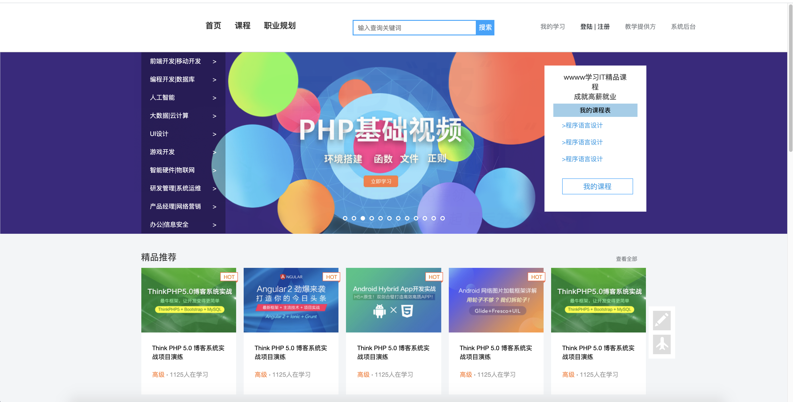

# Nova

This is a comprehensive project of a CMS(content-management-system) of MOOC website.

  

## Table of Contents

- [Background](#Background)
- [TechStack](#Tech-stack)
- [Usage](#Usage)
- [Services](#Services)
- [Contributing](#Contributing)
- [License](#License)

    

## Background

### Name's source

Nova is the name of the 'wild woman' in the movie <Planet of the Apes>. I really like this movie, in this movie, the position of human and apes are exchanged. For apes, human are ignorance; however, after the protagonist come into this planet, he start to enlighten the human on that planet, including one woman, nova.

Besides, nova is also the group's name, which I attend during my master degree in USC. I make friends with many kind guys here, and I really enjoy the life in USC.

### Why Mooc ?

This is long story, in short, I used many Mooc website, for example, coursera, udemy, udacity and xuechengonline in China. I learned a lot from them, so for long time, I desired to build a comprehensive MOOC website myself. Here it comes.

### What is CMS

CMS is the abbreviation of content management system, so what is content management system? 

Basically, it is a system to manage content... Yeah, just like the name. But the question for that project is: 

**What the content includes? **

The answer is simple: ALL you need to display in a MOOC website.

    

## Tech-stack

### Architecture

The project has been selected based on Microservice Architecture.

### Skeleton Framework:

The project based on **Spring-Boot** and **Spring Cloud**. 

Combining of them can ideally build a microservice project.

### Programming Langugage:

The back-end services is based on SpringBoot, so the primary language is JAVA.

However, to render some static html, we also use Freemarker.

### Where is Front-end?

The front-end is also a huge project and it depends on which popular framework you like.

I simply scratch it from xuechengzaixian's version, which is built by Vue.js.

Honestly, I don't like vue.js, so in future, I will rebuild it again by React.

**I am a big fan of React.**

    

## Usage

#### Download it and import it by IntelliJ IDEA.

### 

### Maven and dependency-management

This project's modules are all dependency-managed by MAVEN.

So, check each modules(service) maven file. (pom.xml);

    

## Services

### The five basic services:

To obey the MVC development rules, we build 5 modules at first.

Common: It includes some classes needed by all other services.

Model: It includes data's model.

Parent: It is the parent module of all other modules, the purpose is to simplify our dependency-management process.

Util: It includes some utilities or tools-classes which may be needed by other services.

Api: It is to store all defined APIs. 

### There are usage-services...

1.  Cms: the core service of the total project.
2.  Course-mangement: to management courses info.
3.  Media: to mange media service
4.  Search: to search key word and course info.
5.  Auth: to perform authorization
6.  Ucenter: to management user's info.
7.  Govern: based on Spring-Cloud to govern other services
8.  Govern-gateway: to build the gateway of the whole project.
9.  Media-Proccessor: every video need to be pre-processed. For example, all .avi format files need to be converted to .mp4.
10.  File-System: The project's storage is based on distributed storage.
11.  Learning: to manage the learners's options: for example, retrieve media-resource.

    

## Contributing

Hao Cong

Datasource: Xuecheng Online Mooc 

    

## License

**GPL**

